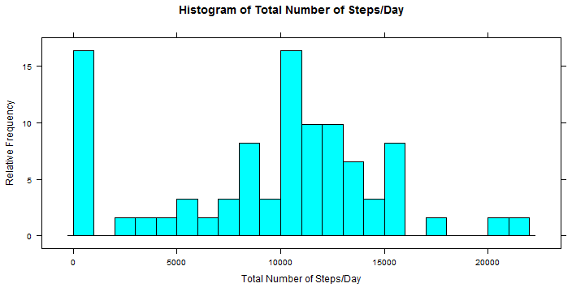
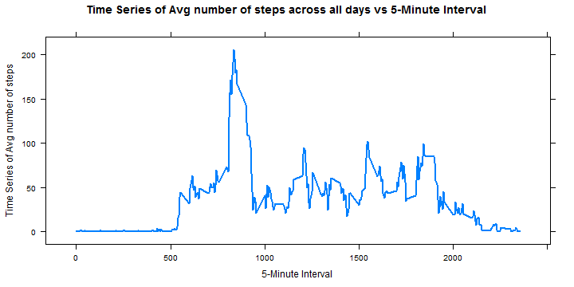
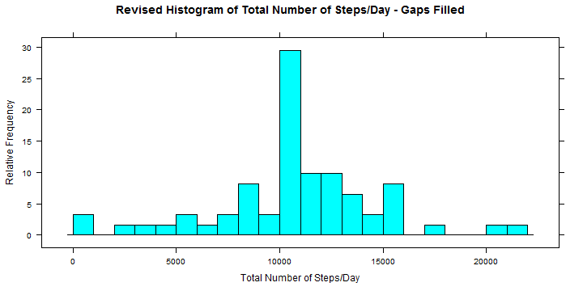
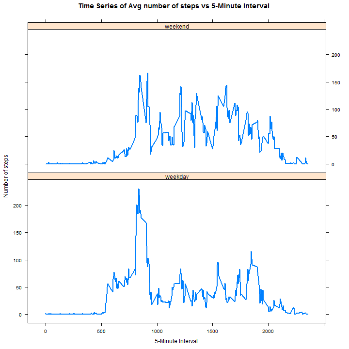

## Loading and preprocessing the dataset

Load the required r-packages for processing the dataset


```r
require(dplyr)
library(dplyr)

require(lattice)
library(lattice)

require(lubridate)
library(lubridate)

require(knitr)
library(knitr)
```


We read in the activity dataset from the raw text file included in the zip archive. The data is a comma delimited file, and missing values are inherently coded as NA fields in the input data file. The header data is included in the reading.


```r
filePath <- "NA"
if(file.exists("./activity.csv"))
{
    filePath <- "./activity.csv"
}

if(file.exists("./activity/activity.csv"))
{
    filePath <- "./activity/activity.csv"
}

filePath
```

```
## [1] "./activity/activity.csv"
```

```r
activity <- read.csv(filePath)
```

Summary and the Column names of the activity dataset:


```r
summary(activity)
```

```
##      steps                date          interval     
##  Min.   :  0.00   2012-10-01:  288   Min.   :   0.0  
##  1st Qu.:  0.00   2012-10-02:  288   1st Qu.: 588.8  
##  Median :  0.00   2012-10-03:  288   Median :1177.5  
##  Mean   : 37.38   2012-10-04:  288   Mean   :1177.5  
##  3rd Qu.: 12.00   2012-10-05:  288   3rd Qu.:1766.2  
##  Max.   :806.00   2012-10-06:  288   Max.   :2355.0  
##  NA's   :2304     (Other)   :15840
```

```r
names(activity)
```

```
## [1] "steps"    "date"     "interval"
```

## What is mean total number of steps taken per day?

- Summarize the sum of the daily steps using grouping of activity data set by date. The summarization is kept in a data frame designated by dailyActivity. This yields the total number of steps per day, averaged across all intervals in a day


```r
dailyActivity <- summarize(group_by(activity,date),sum(steps,na.rm=TRUE))
names(dailyActivity) <- c("date", "StepSum")
```

- Draw a histogram of the total number of steps per day.

```r
histogram(~dailyActivity$StepSum, breaks=30, na.rm=TRUE, main="Histogram of Total Number of Steps/Day", xlab="Total Number of Steps/Day", ylab="Relative Frequency")
```

 

- Compute the mean of the total number of steps taken per day ignoring the missing steps data

```r
mean(dailyActivity$StepSum,na.rm=TRUE)
```

```
## [1] 9354.23
```

- Compute the median of the total number of steps taken per day ignoring the missing steps data

```r
median(dailyActivity$StepSum, na.rm=TRUE)
```

```
## [1] 10395
```

## What is the average daily activity pattern?

- Summarize the average number of steps in each 5-Minute interval using grouping of activity by interval averaged over all days in the activity set. The summarization is kept in a data frame designated as fiveMinActivity  


```r
fiveMinActivity <- summarize(group_by(activity,interval),mean(steps,na.rm=TRUE))
names(fiveMinActivity) <- c("interval", "AvgNumberOfSteps")
```

- Draw a time series plot (i.e. type = "l") of the 5-minute interval (x-axis) and the average number of steps taken, averaged across all days (y-axis)  


```r
xyplot(AvgNumberOfSteps ~ interval,
       fiveMinActivity,
       type = "l", 
       lty = c(1), 
       lwd = c(2), 
       na.rm=TRUE, 
       main="Time Series of Avg number of steps across all days vs 5-Minute Interval", 
       ylab="Time Series of Avg number of steps",
       xlab="5-Minute Interval"
)
```

 

- Rank top 5 of the 5-minute interval with the maximum number of steps averaged over all days in the dataset  


```r
rank5MinActivity_top5 <- head(arrange(fiveMinActivity, desc(AvgNumberOfSteps)))
rank5MinActivity_top5
```

```
## Source: local data frame [6 x 2]
## 
##   interval AvgNumberOfSteps
## 1      835         206.1698
## 2      840         195.9245
## 3      850         183.3962
## 4      845         179.5660
## 5      830         177.3019
## 6      820         171.1509
```

- Identify the 5-minute interval with the maximum number of steps averaged over all days in the dataset  

```r
maxAvgSteps_5MinInterval <- rank5MinActivity_top5$interval[1]
maxAvgSteps_5MinInterval
```

```
## [1] 835
```

## Inputing missing values

- Calculate and report the total number of missing values in the dataset (i.e. the total number of rows with NAs)  


```r
length(which(is.na(activity$steps)))
```

```
## [1] 2304
```

### Filling in all of the missing values in the dataset

Using a simple strategy to fill in missing (NA) step data by filling in the average number of steps taken in a 5-Minute interval averaged across all days (week days and weekend days)

- Merge activity with fiveMinActivity data frame (average steps taken in 5-minute interval averaged over all days in the activity dataset) into a data frame designated as activityMerged. This data frame has an additional column corresponding to AvgNumberOfSteps from the previous analysis  


```r
activityMerged <- merge(activity,fiveMinActivity,by.x="interval",by.y="interval")
dim(activityMerged)
```

```
## [1] 17568     4
```

```r
names(activityMerged)
```

```
## [1] "interval"         "steps"            "date"            
## [4] "AvgNumberOfSteps"
```

- Filter activityMerged by missing data in the steps column (i.e., NA values) into a data frame designated as tactNA. Also filter activityMerged by no NA (i.e., non-NA step data) into a data frame designated as tact  


```r
tactNA <- filter(activityMerged,is.na(steps))
tact <- filter(activityMerged,!is.na(steps))
```

- Assert that the recomposed NA and Non-NA datasets add up to the row numbers in the original dataset  


```r
stopifnot(nrow(tact) + nrow(tactNA) == nrow(activity))
```
- Reconstruct the NA subset to take the AvgNumberOfSteps in place of the steps, and construct the non-NA subset to keep the original data  


```r
activityNA <- select(tactNA,AvgNumberOfSteps,date,interval)
activityNoNA <- select(tact,steps,date,interval)
names(activityNA) = c("steps", "date", "interval")
```
- Merge the two reconstructed datasets using rbind. The resulting dataset will no longer have any missing values for step. The resulting data frame is designated as activityFill  


```r
activityFill <- rbind(activityNA, activityNoNA)
stopifnot(!any(is.na(activityFill$steps)))
```
- Summarize the reconstituted activity dataset with no missing values by date to recompute total number of steps taken per day, averaged across all intervals in a day  


```r
dailyActivityFill <- summarize(group_by(activityFill,date),sum(steps))
names(dailyActivityFill) <- c("date", "StepSum")
```
- Draw a histogram of the total number of steps per day with missing steps data filled up  


```r
histogram(~dailyActivityFill$StepSum, breaks=30, na.rm=TRUE, main="Revised Histogram of Total Number of Steps/Day - Gaps Filled", xlab="Total Number of Steps/Day", ylab="Relative Frequency")
```

 

- Compute the mean of the total number of steps taken per day with missing steps data filled up  


```r
mean(dailyActivityFill$StepSum)
```

```
## [1] 10766.19
```
- Compute the median of the total number of steps taken per day with missing steps data filled up  


```r
median(dailyActivityFill$StepSum)
```

```
## [1] 10766.19
```
- Do these values differ from the estimates from the first part of the assignment? What is the impact of inputing missing data on the estimates of the total daily number of steps?  


```
##       Mean   Median
## 1  9354.23 10395.00
## 2 10766.19 10766.19
```
The histogram of the total daily number of steps with missing step data (NA) shows a bi-modal distribution. The histogram of the total daily number of steps after filling in missing step shows distinctly a single mode distribution resembling a normal distribution. The mean is shifting from 9354.23 with missing step data to 10766.19 after filling in the missing data. The mean and median are the same at 10766.19 after filling in the missing step data.  

## Are there differences in activity patterns between weekdays and weekends?

- Create a new factor variable in the dataset with two levels - "weekday" and "weekend" indicating whether a given date is a weekday or weekend day.  


```r
WDAY <- wday(activityFill$date,label = TRUE, abbr = TRUE)
activityFill <- mutate(activityFill, WDAY)

FnWDayType <- function(x){switch(as.character(x), Sat=, Sun="weekend", "weekday")}

WDAYType <- unlist(lapply(activityFill$WDAY,FnWDayType))
activityFill <- mutate(activityFill, WDAYType=as.factor(WDAYType))
fiveMinActivityWDType <- summarize(group_by(activityFill,interval,WDAYType),mean(steps))

names(fiveMinActivityWDType) <- c("interval", "WDAYType", "AvgNumberOfSteps")
summary(fiveMinActivityWDType)
```

```
##     interval         WDAYType   AvgNumberOfSteps 
##  Min.   :   0.0   weekday:288   Min.   :  0.000  
##  1st Qu.: 588.8   weekend:288   1st Qu.:  2.047  
##  Median :1177.5                 Median : 28.133  
##  Mean   :1177.5                 Mean   : 38.988  
##  3rd Qu.:1766.2                 3rd Qu.: 61.263  
##  Max.   :2355.0                 Max.   :230.378
```

- Make a panel plot containing a time series plot (i.e. type = "l") of the 5-minute interval (x-axis) and the average number of steps taken, averaged across all weekday days or weekend days (y-axis)  

 
